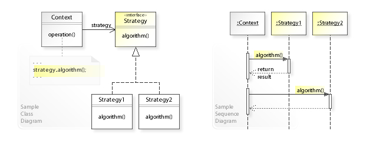

# Strategy

## Diagrama

- Padrão de design de software **comportamental**
  
- **Eliminar comandos condicionais**.
- O **comportamento é desacoplado** pelas classes que a utilizam.
- Maior **facilidade de testar**.
- **Reuso** de um algoritmo.
- **Decide** qual algoritmo será selecionado **em tempo de execução**.
- **Princípio Open/Closed | Aberto Fechado do SOLID**: As entidades de software devem ser abertas à extensão, mas fechadas à modificação.

## Quando utilizar?

- Quando muitas **classes relacionadas diferem somente no seu comportamento**
- Necessário **variantes de um mesmo algoritmo**
- Um algoritmo usa dados dos quais os clientes não deveriam ter conhecimento.

### Pontos positivos

- **Defini novas operações sem alterar as classes** já existentes.
- **Reuso** do algoritmo
- **Elimina comandos condicionais**
- Possibilita a **escolha de implementações a partir da família do algoritmo**.

### Pontos negativos

- **Os clientes devem conhecer diferentes Strategies**;
- **Custo de comunicação** entre Strategy e Context