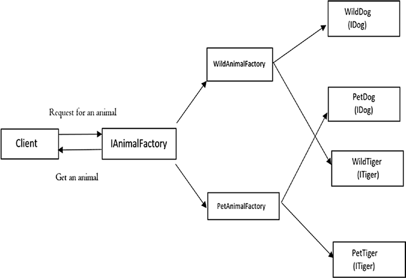

# Abstract Factory

## Diagrama

- Padrão de design de software de **criação**
  
- Abstract Factory oferece a **interface para criar uma família de objetos relacionados**, sem especificar explicitamente suas classes

- AbstractFactory usa **composição** para **delegar a responsabilidade de criar um objeto para outra classe**, enquanto o padrão de projeto do método Factory usa herança e depende da classe derivada ou subclasse para criar o objeto
    - **COMPOSIÇÃO**: 
      - Princípio de **programar para uma interface** e não para uma implementação.
      - Comportamento pode ser escolhido em tempo de execução
      - Menor dependência de implementações e temos cada classe focada em apenas uma tarefa seguindo outro **principio da responsabilidade única**.
      - Bom **encapsulamento** onde os **detalhes internos dos objetos instanciados não são visíveis**.
    
## Vantagens

- As classes de objetos concretos têm um acoplamento fraco com o cliente, assim obteremos melhor flexibilidade e reutilização do código
- O processo de criação de novos tipos de objetos é unificado em uma única interface, facilitando a manutenção do código base
- É compatível com o Princípio Aberto/Fechado – portanto, podemos estender a funcionalidade adicionando novas fábricas sem afetar o código existente