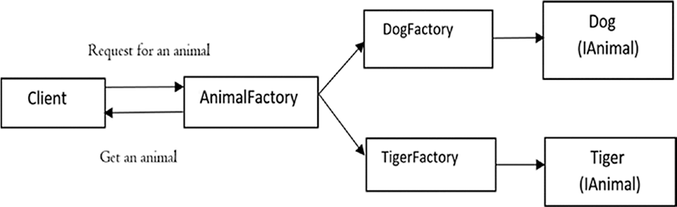

# Factory Method

## Diagramas

- Padrão de design de software de **criação**
- Define uma interface para criar um objeto, mas deixe as subclasses decidirem qual classe instanciar.
- Delega a responsabilidade de inicializar uma classe do cliente para uma classe de fábrica específica criando um tipo de "construtor virtual"/"inteligente".
- Usa **herança** e **depende da classe derivada ou subclasse para criar o objeto**.

##Objetivo

O método de fábrica geralmente é usado quando você tem algum processamento genérico em uma classe, mas deseja variar o tipo de objeto retornado.
Reutilizando assim a funcionalidade comum implementando um método de fábrica nas subclasses.

## Identificando

Reconhecidos por métodos de criação, que criam objetos de classes concretas, mas os retornam como objetos de tipo ou interface abstrata.

## Vantagens

- Fornece aos usuários uma maneira de estender componentes internos.
- **Reutilizar objetos existentes em vez de recriá-los sempre**.
- **Princípio de Responsabilidade Única**: Evita acoplamentos entre classes.
  - Você pode mover o código de criação do produto para um único local do programa, facilitando a manutenção do código.
- **Princípio aberto/fechado**
  - Você pode introduzir novos tipos de produtos no programa sem quebrar o código cliente existente.
  - Por exemplo, para adicionar um novo tipo de produto à aplicação, só será necessário criar uma nova subclasse criadora e substituir o método fábrica nela.

## Desvantagens

- O código pode se tornar mais complicado
  - Você precisa introduzir muitas subclasses novas para implementar o padrão. 
    
O melhor cenário é quando você está introduzindo o padrão em uma hierarquia existente de classes criadoras.

## Implementando

- O Produto declara a interface, que é comum a todos os objetos que podem ser produzidos pelo criador e suas subclasses.

- Produtos concretos são implementações diferentes da interface do produto.

- A classe Criador declara o método fábrica que retorna novos objetos produto. É importante que o tipo de retorno desse método corresponda à interface do produto.

  - Você pode declarar o método fábrica como abstrato para forçar todas as subclasses a implementar suas próprias versões do método. Como alternativa, o método fábrica base pode retornar algum tipo de produto padrão.

- Criadores Concretos sobrescrevem o método fábrica base para retornar um tipo diferente de produto.

