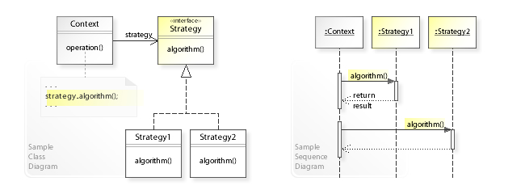

#Strategy

## Diagrama

- Padrão de design de software **comportamental**
- O **comportamento é desacoplado** pelas classes que a utilizam.
- Decide qual algoritmo será selecionado em tempo de execução.
- **Princípio Open/Closed | Aberto Fechado**: As entidades de software devem ser abertas à extensão, mas fechadas à modificação.
